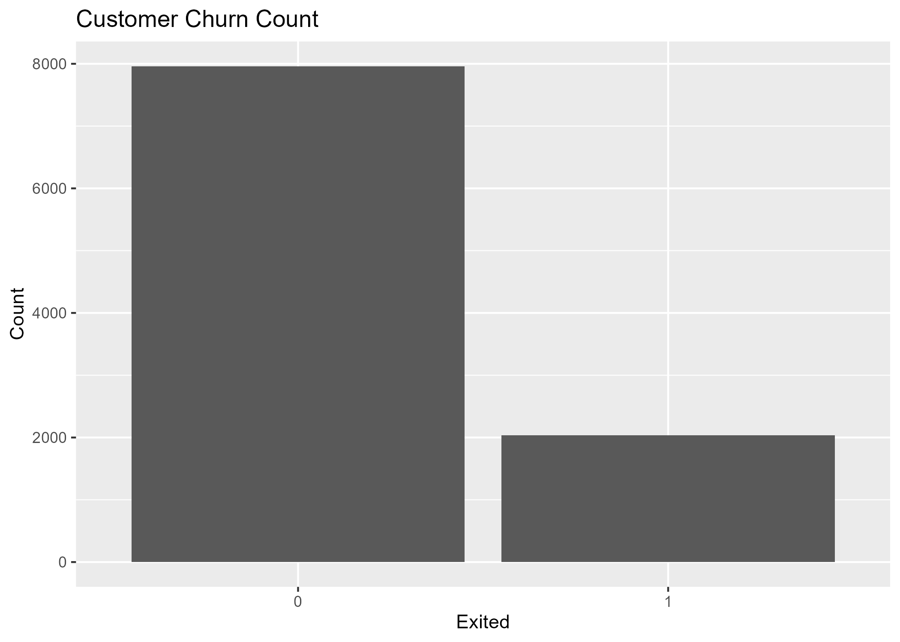
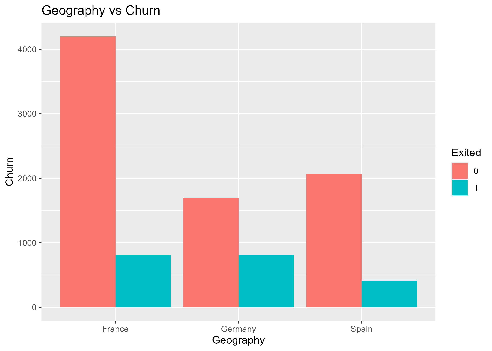
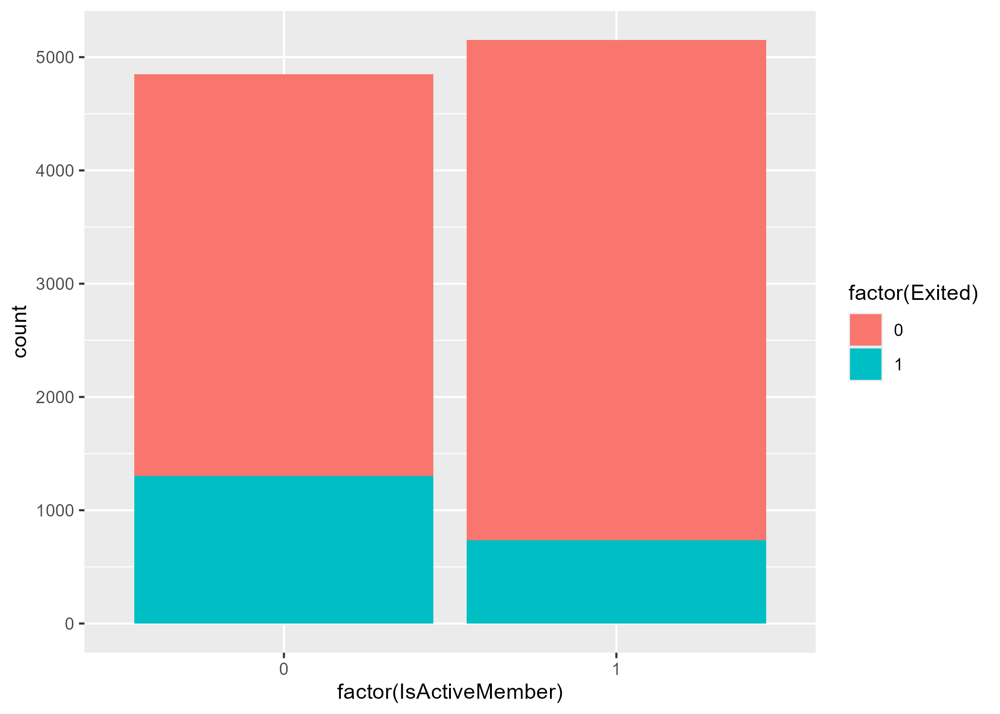
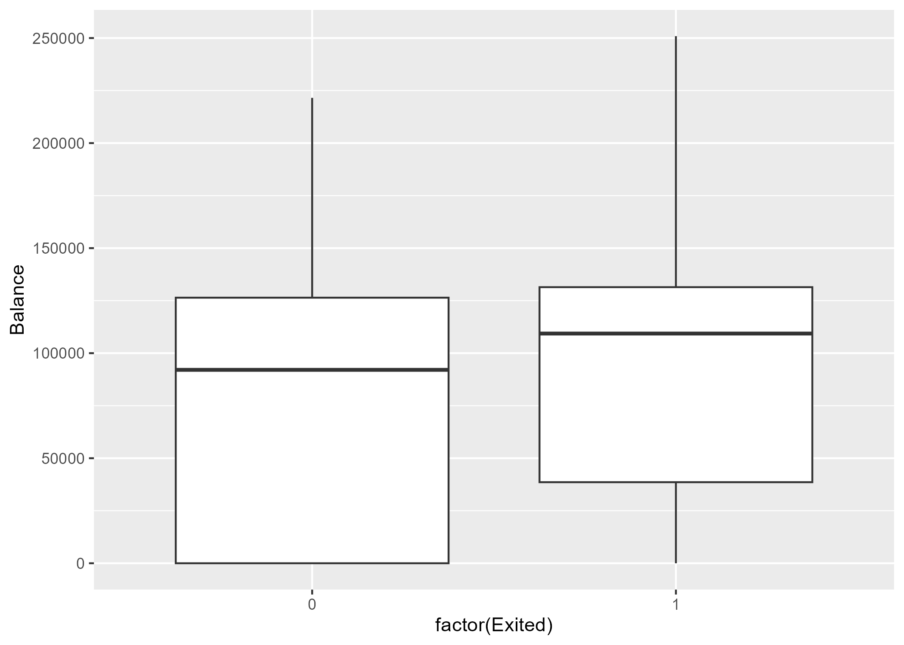
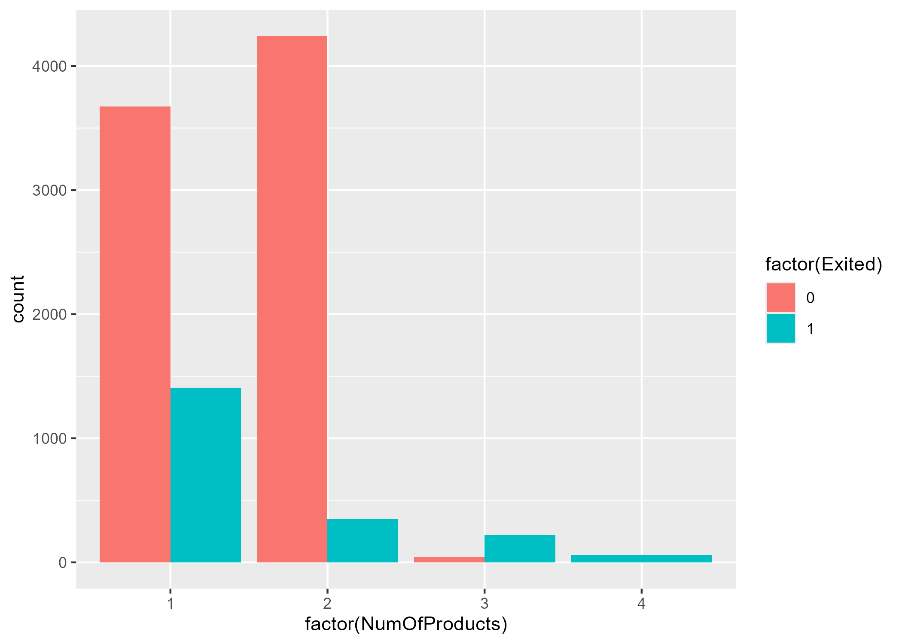
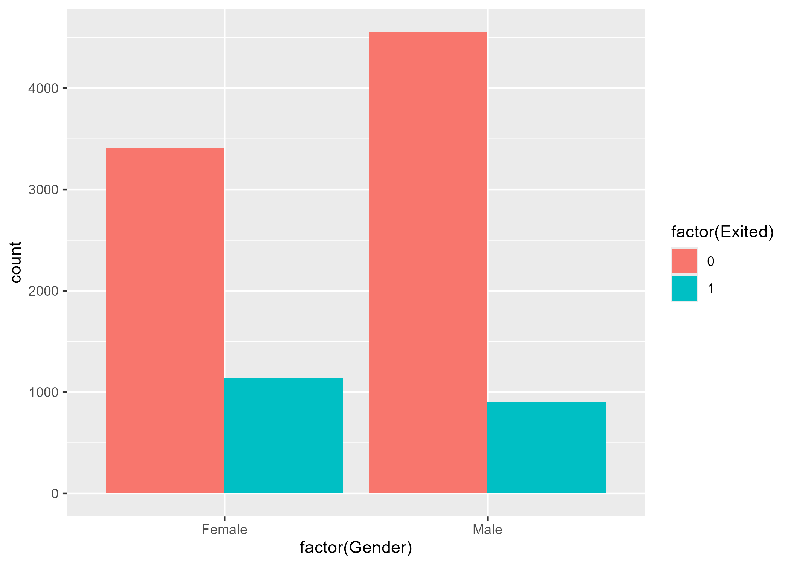
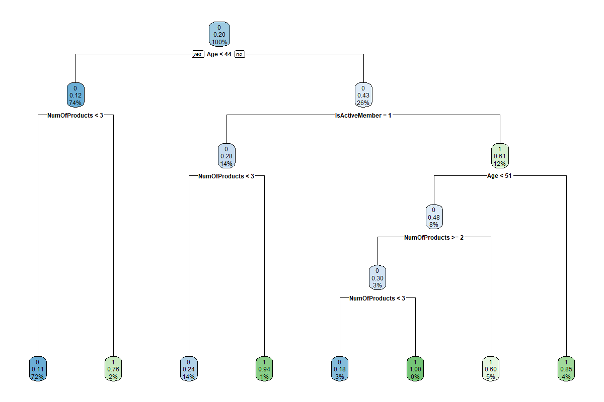

# customer-churn-prediction-r
Customer churn prediction project using R, logistic regression, decision tree, and random forest.
# Customer Churn Prediction Using R

## Problem Statement

Customer churn is a major business problem because companies lose revenue when customers leave. The goal of this project is to analyze customer data and build machine learning models to predict whether a customer is likely to exit or stay with the company.

This project helps identify important customer factors related to churn, such as age, geography, account balance, number of products, activity status, and credit score.

## Data

The dataset used in this project is a customer churn dataset. It contains customer demographic, financial, and account-related information.

Important variables include:

- CreditScore
- Geography
- Gender
- Age
- Tenure
- Balance
- NumOfProducts
- HasCrCard
- IsActiveMember
- EstimatedSalary
- Card.Type
- Point.Earned
- Exited

The dependent variable is `Exited`.

- `Exited = 0`: Customer did not leave
- `Exited = 1`: Customer left

## Data Mining Operations

### Data Wrangling

The data preparation process included:

- Loading the dataset in R
- Checking rows and columns
- Reviewing column names and data types
- Checking summary statistics
- Checking for missing values
- Selecting important variables
- Converting categorical variables into factors
- Splitting the data into training and testing sets

### Modeling

Three classification models were used:

1. Logistic Regression
2. Decision Tree
3. Random Forest

This is a supervised machine learning classification problem because the target variable, `Exited`, is known.

## Libraries Used

The main R libraries used were:

- `ggplot2` for data visualization
- `caret` for model evaluation and train/test split
- `rpart` for decision tree modeling
- `rpart.plot` for decision tree visualization
- `randomForest` for random forest classification

## Why These Algorithms Were Chosen

Logistic Regression was chosen because it is useful for binary classification and helps explain which variables are statistically significant.

Decision Tree was chosen because it is easy to interpret and shows how customer features split into churn and non-churn groups.

Random Forest was chosen because it combines many decision trees and can improve prediction performance.

## Model Outputs

| Model | Accuracy |
|---|---:|
| Logistic Regression | 81.13% |
| Decision Tree | 85.93% |
| Random Forest | 86.63% |

The Random Forest model performed the best with the highest accuracy.

## Sample Visualizations

### Customer Churn Count

### Geography vs Churn

### Active Member vs Churn

### Balance vs Churn

### Number of Products vs Churn

### Gender vs Churn

### Decision Tree Model

## Data Insights

The analysis showed that several customer features are related to churn.

Age appeared to be an important factor because older customers showed a higher tendency to churn.

Geography also showed differences in customer churn patterns.

Active membership was important because inactive customers were more likely to churn.

The Random Forest model showed that variables such as Age, NumOfProducts, Balance, EstimatedSalary, CreditScore, and Point.Earned were important predictors.

## Limitations

Some limitations of this project include:

- The dataset may not include all real-world factors that affect churn.
- The dataset does not show customer behavior over time.
- Accuracy alone may not fully explain model performance.
- More evaluation metrics such as precision, recall, F1-score, and ROC-AUC could improve the analysis.
- The model may need testing on newer customer data before real business use.

## Were We Able to Effectively Solve the Problem?

Yes. This project effectively addressed the problem by analyzing customer churn patterns, creating visualizations, building classification models, and comparing model performance.

The Random Forest model gave the best result with an accuracy of approximately 86.63%, making it the strongest model in this project.

## Skills Demonstrated

- R programming
- Data cleaning
- Exploratory data analysis
- Data visualization
- Logistic regression
- Decision tree classification
- Random forest classification
- Model evaluation
- Business analytics interpretation

## Tools Used

- R
- RStudio
- GitHub
- ggplot2
- caret
- rpart
- rpart.plot
- randomForest
